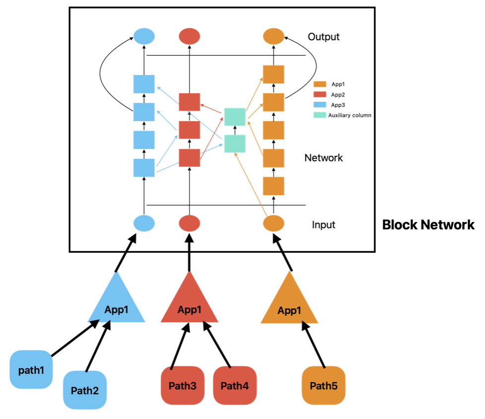

# M.sc Project (AI as a Service: DNNs Coordination on Edge)

## Introduction

The main goal of this project is to develop a framework that allows the coordination of multiple DNNs on edge devices.

* Each DNN is considered as an Application.
* Each App has a main path and can have multiple cooridnated paths.

This code has a hierarchical structure. Paths with the same parent-app are considered as a group and each of these 
groups has a shared app.
Also, all the app have a shared network with these properties:
* it contains all the app's input nodes.
* each app has access to its own input nodes.
* paths must access to the shared network through the shared app.
* to find any other nodes int the network, paths must crawl the network.

Classes:

* DnnApp: represents an application.
* Path: represents a path. child of torch.nn.Module.
* BlockNetwork: network of DNN blocks.
* Node: DNN node in the Block Network. they subscribe to the paths which contain them.

## Current Apps:

* App1 -> bert-base-uncased: BERT model. prediction of the masked words. 
(https://huggingface.co/bert-base-uncased)

* App2 -> german-sentiment-bert: BERT model. sentiment analysis of the german sentences. 
(https://huggingface.co/oliverguhr/german-sentiment-bert)

* App3 -> alex-net: CNN model. trained for different applications (cfar-10, food-101, image-net)

* App4 -> mobile-net: CNN model. classification (image-net)

* App5 -> CLIP: BERT based model for multimodal applications. image and text multimodal model

## How to create and train a new path:

* select main app and cooridnated app (optional)
* select the exit and input nodes of the branches

Now the path has inserted fc-layers in the input and output nodes of the branches.

* to train the new path first fetch the nodes of the paths
* then train the path (only the fc-layers will be trained) 

## How to test the code:

some tests are available in the test folder. (not updated)

